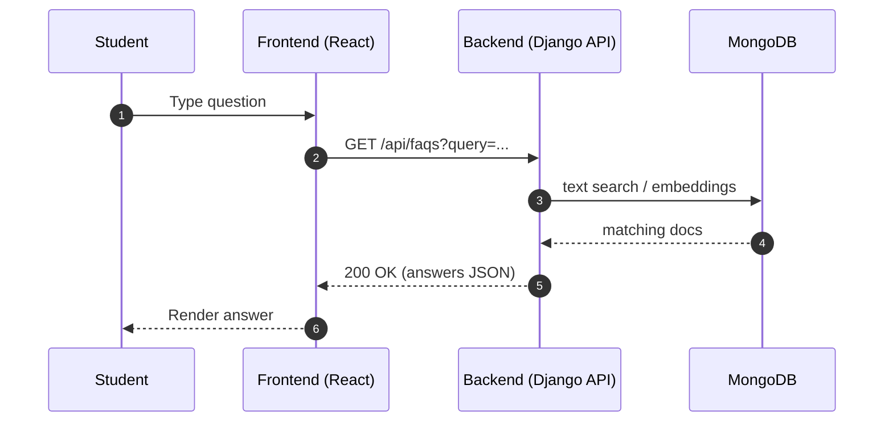
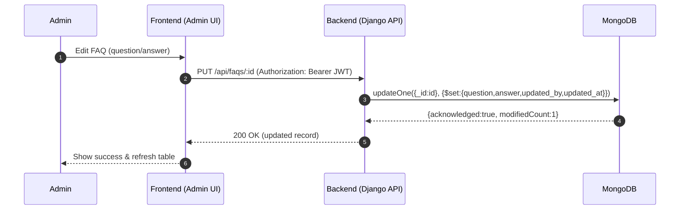
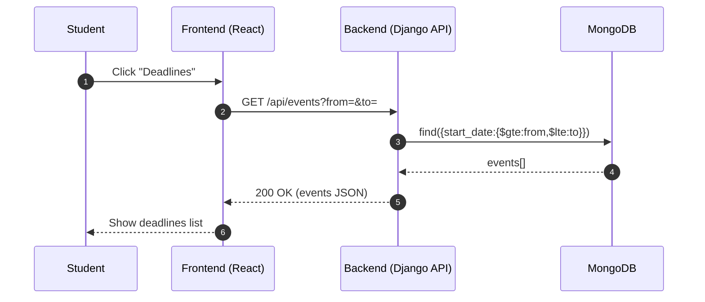

# 📄 Stage 3 – Technical Documentation: (Unibot)

---

## 📝 Task 0: Define User Stories and Mockups

### User Stories (MoSCoW)

**Must Have**
- As a **student**, I want to **search for FAQs by keyword**, so that **I can quickly find answers**.  
- As a **student**, I want to **know deadlines of activities/services**, so that **I don’t miss important dates**.  
- As a **student**, I want to **get information about campus facilities (library, cafeteria, gym)**, so that **I can plan my visits**.  
- As an **admin**, I want to **add or update FAQs**, so that **the chatbot always has accurate information**.  

**Should Have**
- As a **student**, I want to **ask the chatbot general questions about university events and announcements**, so that **I stay informed and engaged**.  
- As a **student**, I want to **access the chatbot from web**, so that **I can use it wherever I am**.

**Could Have**
- As a **student**, I want to **rate chatbot answers**, so that **future responses can improve**.  
- As a **student**, I want to **save frequently asked questions**, so that **I can access them quickly later**.  

**Won’t Have (MVP)**
- Voice commands.  
- Access to personalized academic data (grades).  
- Multi-language support.  

### Mockups
- **Chatbot Interface:**  
  
- **Admin Dashboard:**  
  

---

## 📝 Task 1: System Architecture

**High-Level Components**
- **Frontend:** React (Web).  
- **Backend:** Python + Django REST Framework (DRF).  
- **Database:** MongoDB.  
- **Search (optional):** Rasa / Vector Store.  
- **External APIs (future):** University Calendar, OpenAI.  

**Data Flow:** Student → Frontend → Backend(API) → DB/Search → Response → Student

```mermaid
flowchart LR
  student[Student (Web)] --> fe[Frontend - React]
  fe -->|REST| be[Backend - Django (DRF)]
  be -->|CRUD & Queries| db[(MongoDB)]
  be -->|Search/Rank| vs[(Rasa / Vector Store - optional)]
  be -->|Events/AI (optional)| ext[(External APIs)]
  be --> fe
  fe --> student
```

---

## 📝 Task 2: Components, Classes, and Database Design

### 2.1 Back-End Components / Services

**AuthService**
- `login(email, password) → token`  
- `generate_token(user)`  
- `verify_token(token)`

**FaqService**
- `list_faqs(query, category_id)`  
- `get_faq(id)`  
- `create_faq(data, user)`  
- `update_faq(id, data, user)`  
- `delete_faq(id)`

**EventService**
- `list_events(from, to)`  
- `create_event(data)`  
- `update_event(id, data)`  
- `delete_event(id)`

**SearchService**
- `search(query, top_k)`  
- `index_faq(faq)` *(optional with vector store/Rasa)*

**FeedbackService**
- `submit_feedback(faq_id, helpful, comment, user)`  
- `list_feedback(faq_id)`

**FavoriteService (optional)**
- `toggle_favorite(user_id, faq_id)`  
- `list_favorites(user_id)`

### 2.2 Database Design (MongoDB – Document Oriented)

**users**
```json
{ "_id":"UUID", "name":"string", "email":"string", "password_hash":"string", "role":"admin|student", "created_at":"ISODate", "updated_at":"ISODate" }
```

**categories**
```json
{ "_id":"UUID", "name":"string" }
```

**faqs**
```json
{ "_id":"UUID", "question":"text", "answer":"text", "category_id":"UUID", "updated_by":"UUID", "updated_at":"ISODate", "created_at":"ISODate" }
```

**events**
```json
{ "_id":"UUID", "title":"string", "start_date":"ISODate", "end_date":"ISODate", "location":"string", "description":"string", "created_at":"ISODate", "updated_at":"ISODate" }
```

**feedback**
```json
{ "_id":"UUID", "faq_id":"UUID", "user_id":"UUID", "helpful":true, "comment":"string", "created_at":"ISODate" }
```

**favorites**
```json
{ "_id":"UUID", "user_id":"UUID", "faq_id":"UUID", "created_at":"ISODate" }
```

---

## 📝 Task 3: Sequence Diagrams

### Use Case 1 — Student asks FAQ


### Use Case 2 — Admin updates FAQ


### Use Case 3 — Student views events


---

## 📝 Task 4: API Specifications

### Internal APIs (Django + DRF)

| Endpoint            | Method | Input                                   | Output                                     | Role     |
|---------------------|--------|-----------------------------------------|--------------------------------------------|----------|
| `/api/auth/login`   | POST   | `{email, password}`                     | `{token, role}`                            | Admin    |
| `/api/faqs`         | GET    | `?query=keyword&category=_id`           | `[{_id, question, answer, category_id}]`   | Student  |
| `/api/faqs`         | POST   | `{question, answer, category_id}`       | `{_id, question, answer, category_id}`     | Admin    |
| `/api/faqs/:id`     | PUT    | `{question?, answer?}`                  | `{_id, question, answer, updated_at}`      | Admin    |
| `/api/events`       | GET    | `{from?, to?}`                          | `[{_id, title, start_date, end_date}]`     | Student  |
| `/api/feedback`     | POST   | `{faq_id, helpful, comment?}`           | `{_id, faq_id, helpful, comment}`          | Student  |
| `/api/favorites`    | POST   | `{faq_id}`                              | `{_id, user_id, faq_id}`                   | Student  |
| `/api/favorites`    | GET    | `Authorization: JWT`                    | `[{_id, faq_id, created_at}]`              | Student  |

### External APIs (Future)
- **University Calendar API** – official deadlines/events.  
- **University Announcements API** – news/alerts.  
- **OpenAI API** – better natural-language answers.  
- **Rasa NLU (optional)** – intent/entity extraction.

---

## 📝 Task 5: SCM and QA Strategies

### Source Control (SCM)
- **Repository:** GitHub  
- **Branching:** `main` (prod), `dev` (integration), `feature/*` (per feature)  
- **Process:** Pull Requests → Code Review → Merge (protected branches)

### Quality Assurance (QA)
- **Backend:** Django Test Framework + `pytest` (unit & integration)  
- **Frontend:** React Testing Library  
- **API Testing:** Postman / DRF APIClient  
- **Linting:** `black` + `flake8` (+ `flake8-django`), `eslint` for JS  
- **CI/CD:** GitHub Actions – run tests & linters on each PR (with MongoDB service)

---

# 📌 Final Deliverable
This single document includes:
- **Task 0:** User Stories & Mockups  
- **Task 1:** System Architecture (Mermaid)  
- **Task 2:** Components & MongoDB Schema  
- **Task 3:** Sequence Diagrams (Mermaid)  
- **Task 4:** API Specs (Internal + Future External)  
- **Task 5:** SCM & QA Strategies
