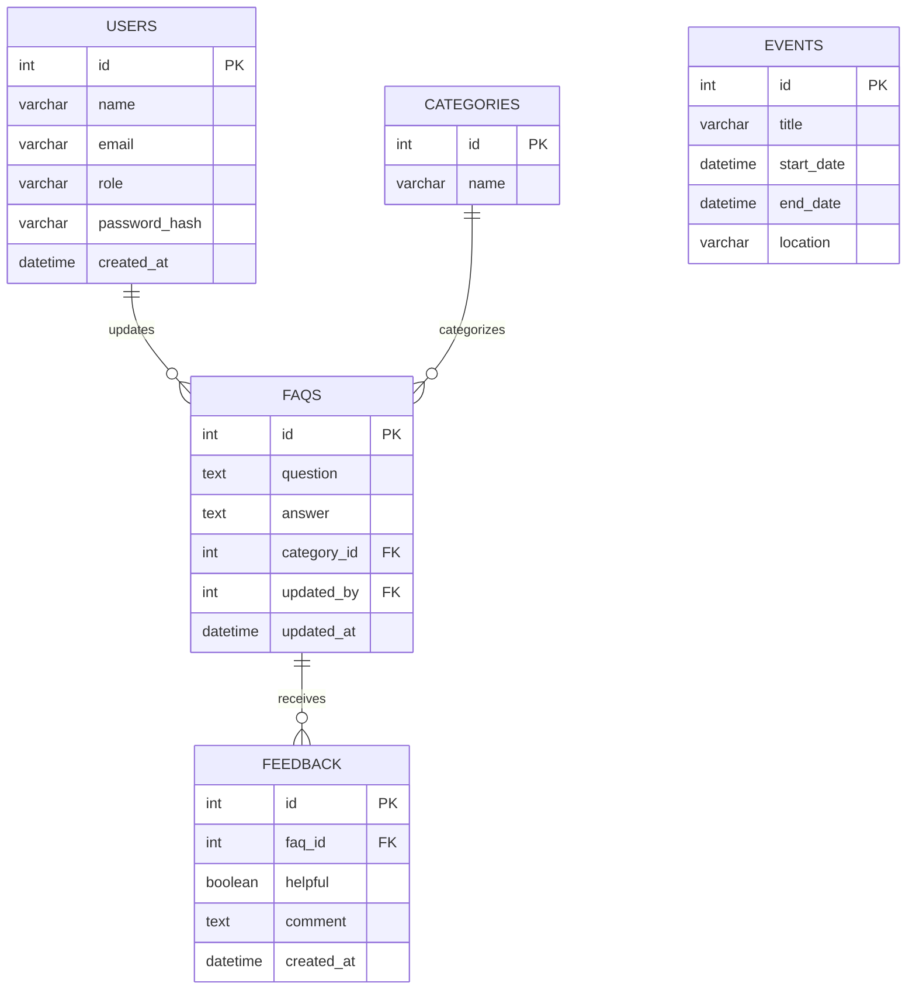

# 📄 Stage 3 – Technical Documentation: (Unibot)

---

## 📝 Task 0: Define User Stories and Mockups

### User Stories (MoSCoW)

**Must Have**
- As a **student**, I want to **search for FAQs by keyword**, so that **I can quickly find answers**.  
- As a **student**, I want to **know deadlines of activities/services**, so that **I don’t miss important dates**.  
- As a **student**, I want to **get information about campus facilities (library, cafeteria, gym)**, so that **I can plan my visits**.  
- As an **admin**, I want to **add or update FAQs**, so that **the chatbot always has accurate information**.  

**Should Have**
- As a **student**, I want to **ask the chatbot general questions about university events and announcemtns**, so that **I stay informed and engaged**.
- As a **student**, I want to **access the chatbot from web**, so that **I can use it wherever I am**

**Could Have**
- As a **student**, I want to **rate chatbot answers**, so that **future responses can improve**.
- As a **student**, I want to **save frequently asked questions**, so that **I can access them quickly later**. 

**Won’t Have (MVP)**
- As a **student**, I want to **interact with the chatbot using voice commands**, so that **I can have a hands-free experience**.
- As a **student**, I want the chatbot to **access my grades and personal academic data**, so that **I can get personalized academic insights**.
- As a **student**, I want the chatbot to **speak in multiple languages**, so that **I can interact in my preferred language**.

### Mockups

- **Chatbot Interface:**  
  
 

- **Admin Dashboard:**  
  
  

---

## 📝 Task 1: System Architecture

**High-Level Components**
- **Frontend:** React web interface.  
- **Backend:** Python + Django Framework.  
- **Database:** MongoDB.  
- **Search Engine (if applicable):** Rasa.  
- **External API (if applicable):** Optional (University Calendar in future, OpenAI).

**Data Flow**
Student → Frontend → Backend (API) → Database/Search → Response → Student  

---

## 📝 Task 2: Components, Classes, and Database Design

### 2.1 Component/Class Descriptions (Back-end)

- **FaqService**
  - **Methods:** `list_faqs(query, category_id)`, `get_faq(id)`, `create_faq(data)`, `update_faq(id, data)`, `delete_faq(id)`

- **SearchService**
  - **Methods:** `search(query, top_k)`, `index_faq(faq)`

- **EventService**
  - **Methods:** `list_events(from, to)`, `create_event(data)`, `update_event(id, data)`, `delete_event(id)`

- **AuthService**
  - **Methods:** `login(email, password)`, `generate_token(user)`, `verify_token(token)`

---

### 2.2 ER Diagram / Database Schema (Relational)

#### ER Diagram (Mermaid)

---

## 📝 Task 3: Sequence Diagrams

---

## 📝 Task 4: API Specifications

### Internal APIs

| Endpoint          | Method | Input                          | Output                          | Role   |
|-------------------|--------|--------------------------------|---------------------------------|--------|
| `/api/auth/login` | POST   | {email, password}             | {token, role}                   | Admin  |
| `/api/faqs`       | GET    | ?query=keyword&category=id    | [{id, question, answer}]        | Student|
| `/api/faqs`       | POST   | {question, answer, category_id}| {id, question, answer}          | Admin  |
| `/api/faqs/:id`   | PUT    | {question?, answer?}          | {id, question, answer}          | Admin  |
| `/api/events`     | GET    | {from?, to?}                  | [{id, title, start_date,...}]   | Student|
| `/api/feedback`   | POST   | {faq_id, helpful, comment?}   | {id, faq_id, helpful, comment}  | Student|

### External APIs (Future)
- University Calendar API.  
- University Announcements API.
- OpenAI API  

---

## 📝 Task 5: SCM and QA Strategies

### Source Control (SCM)
- **Repository:** GitHub.  
- **Branching Strategy:**  
  - `main` → production-ready.  
  - `dev` → integration branch.  
  - `feature/*` → per feature.  
- **Process:** Pull Requests → Code Review → Merge.  

### Quality Assurance (QA)
- **Backend:** pytest (unit + integration tests).  
- **Frontend:** React Testing Library.  
- **API Testing:** Postman.  
- **Linting:** black + flake8 (Python), ESLint (JS).  
- **CI/CD:** GitHub Actions to run tests/lint checks for each PR.  

---

# 📌 Final Deliverable: Stage 3 – Technical Documentation (Unibot)

This document consolidates all the outputs of Stage 3 for the **Unibot** project, including:

- **Task 0:** User Stories and Mockups  
- **Task 1:** System Architecture  
- **Task 2:** Components, Classes, and Database Design  
- **Task 3:** Sequence Diagrams  
- **Task 4:** API Specifications  
- **Task 5:** SCM and QA Strategies
  
